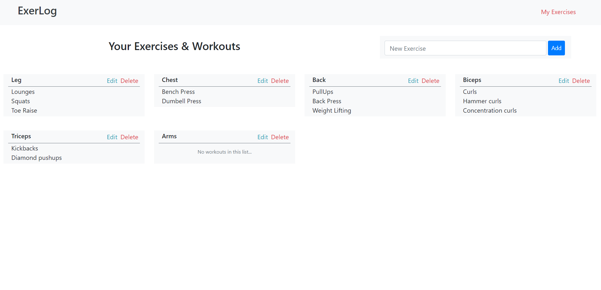

# ExerLog

> A simple exercise tracker to track your day to day workouts.

### Technologies

`MERN` `GraphQL`
Auth: Passport OAuth 2.0

<h6>
#1 Home(Track your day-to-day workouts) | #2 Your Exercises List
</h6>

[Similar Mobile App](https://github.com/A7abhilash/exerlog-app)
